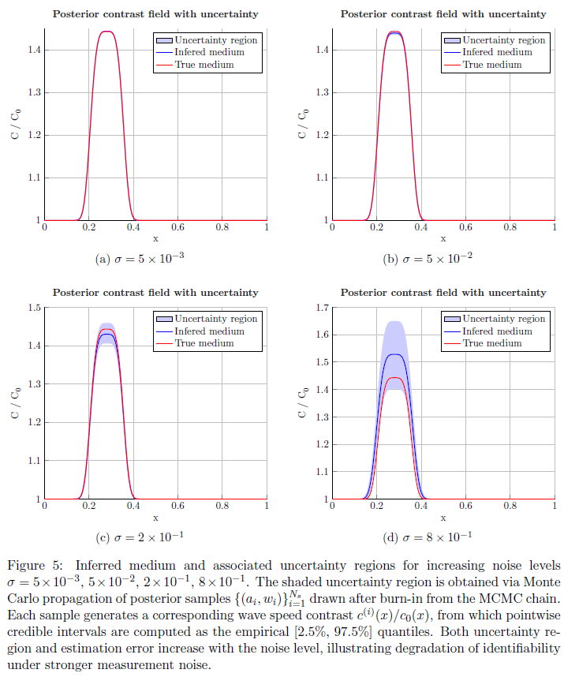

# Bayesian Wave Inversion and Uncertainty Quantification
## Markov Chain Monte Carlo for Parameter Estimation in the Wave Equation

Waveform inversion aims to infer quantitative properties of an inaccessible medium from data
collected by an array of sources and receivers that emit probing signals and record the resulting
scattered waves. In practical settings, these measurements are inevitably contaminated by noise
and subject to modeling uncertainties, which makes the inverse problem ill-posed and sensitive
to perturbations in the data. To address this challenge, stochastic inference methods provide
a natural framework for incorporating measurement uncertainty directly into the reconstruction
process. In particular, Bayesian approaches allow the unknown parameters to be treated
as random variables, enabling both stable inversion under noise and principled uncertainty
quantification through posterior distributions. This work presents a numerical investigation of
Bayesian waveform inversion using MCMC methods, focusing on how observation noise influences
parameter recovery, posterior uncertainty, and identifiability in two representative inverse
problems.

